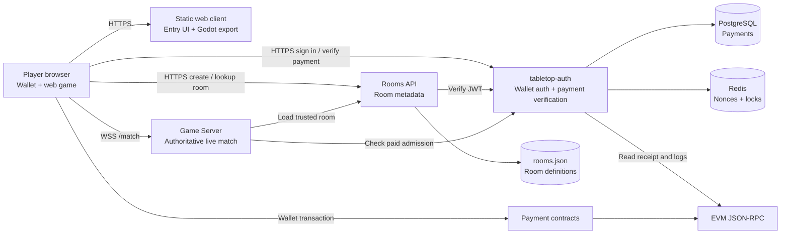
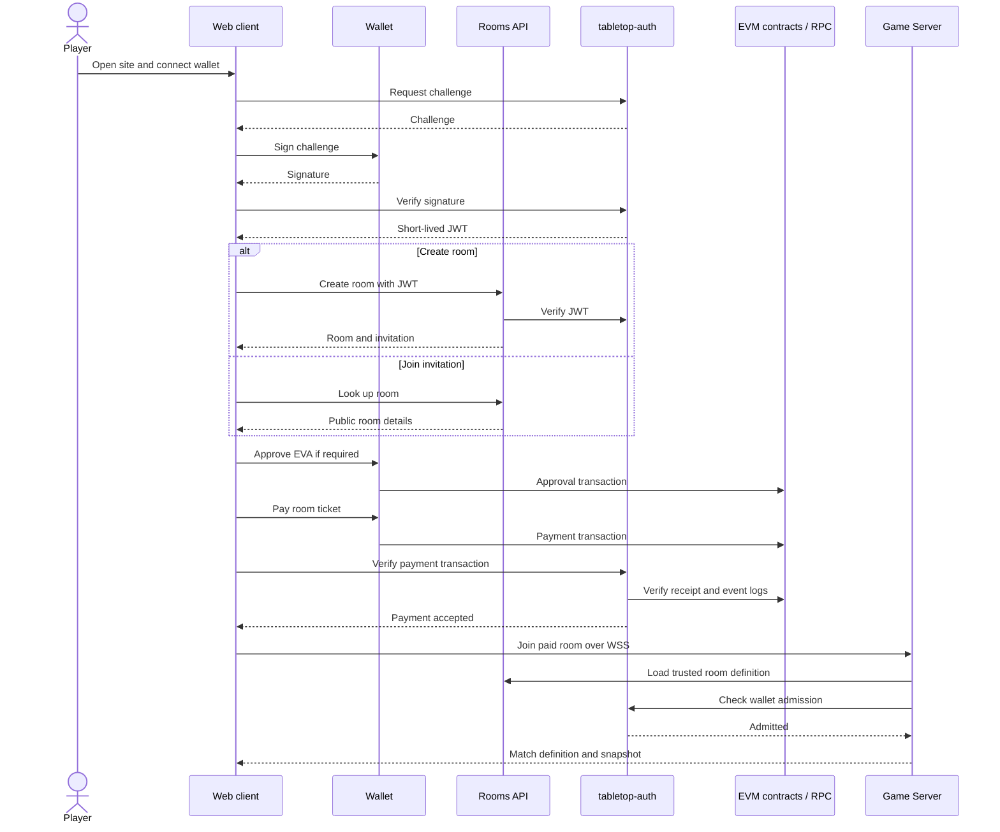
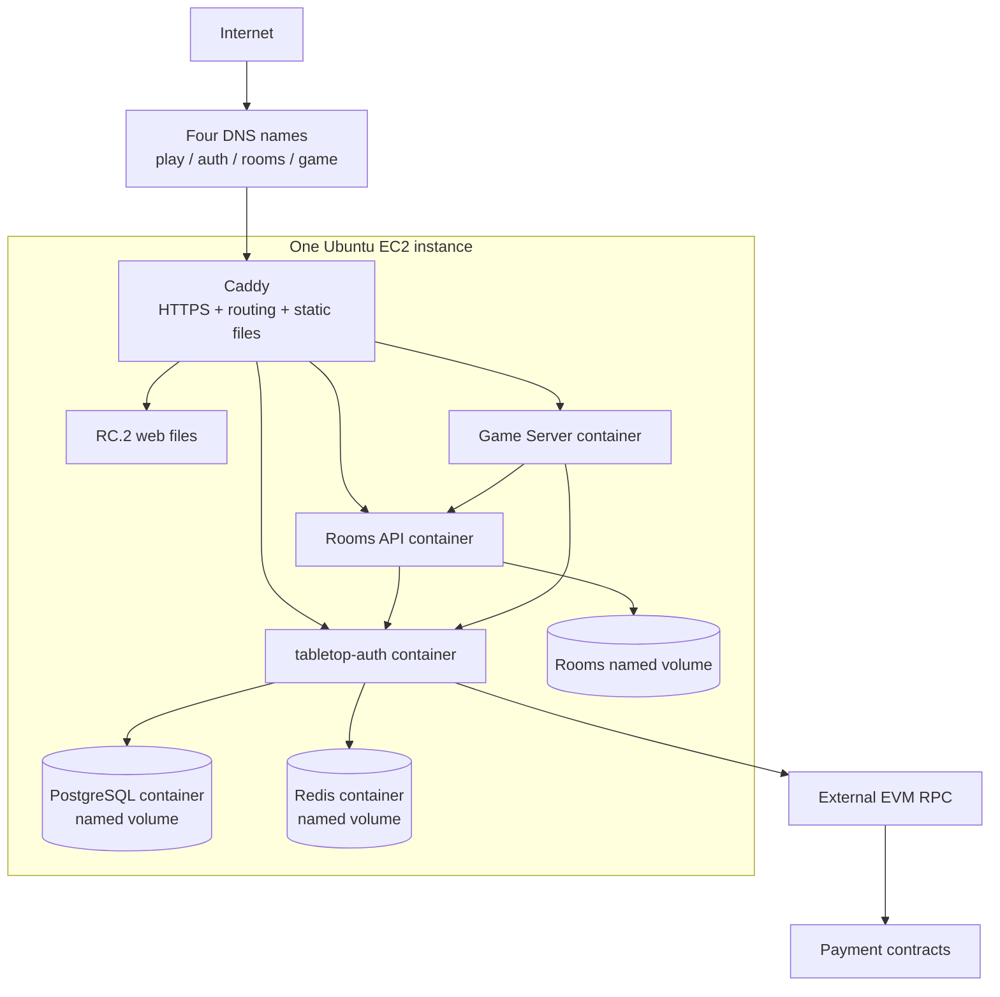

# Evanopolis V1 Architecture Overview

This is the canonical system-level architecture document for Evanopolis V1.
It shows the deployed components, their responsibilities, and the paid-player
entry path. Detailed protocol, implementation, and deployment documents are
linked at the end.

## System at a glance

The browser coordinates the user experience, but it is not trusted to decide
identity, payment, room settings, or game results.

## Component responsibilities

| Component | Owns | Does not own |
| --- | --- | --- |
| Web client | Wallet UI, room entry, payment submission, Godot presentation | Identity, payment truth, room truth, game rules |
| Rooms API | Room creation and public room metadata | Payments and live matches |
| `tabletop-auth` | Wallet authentication, JWTs, payment verification, paid admission | Room metadata and gameplay |
| Game Server | Match state, rules, turns, player actions, admission enforcement | Wallet login and blockchain writes |
| PostgreSQL | Durable auth/payment records | Live match state |
| Redis | Short-lived auth nonces and coordination locks | Durable payment records |
| Rooms volume | Durable `rooms.json` for one Rooms API writer | Live match state |
| EVM contracts | EVA approval and ticket-payment transactions | Web sessions and gameplay |

## Paid player entry

The same room flow is used by the creator and invited players. Each paid seat
is verified for its wallet before the Game Server admits it.

## AWS quick-start deployment

The quick-start deliberately favors simplicity: every service runs on one EC2
instance with Docker Compose.

Only ports 80 and 443 are public for application traffic. PostgreSQL, Redis,
and the application containers are reachable only inside the Compose network.
Caddy obtains TLS certificates and routes each hostname to the correct
container. The web files are served directly by Caddy.

This layout has three intentional limitations:

- It has one failure domain: if the EC2 instance stops, the whole system stops.
- Game Server memory contains active matches, so a restart ends them.
- Rooms API uses one JSON-file writer, so it and the Game Server must each run
  as a single instance.

Use the advanced AWS guide when the deployment needs managed databases,
separate failure domains, or independent service scaling.

## Trust and persistence boundaries

- The Game Server is authoritative for all gameplay and player actions.
- `tabletop-auth` is authoritative for wallet identity and payment admission.
- The Rooms API is authoritative for room configuration.
- The web client is untrusted presentation and orchestration code.
- PostgreSQL and `rooms.json` require backups.
- Redis can be recreated; losing it invalidates pending login challenges.
- Active matches are not persisted and cannot survive a Game Server restart.
- The current production-shaped deployment supports one Rooms API writer and
  one Game Server process.

## Related documentation

| Topic | Document |
| --- | --- |
| Fast AWS installation | [Five-Minute AWS Server Setup](../deployment/live-server-setup.md) |
| Managed AWS architecture | [Advanced AWS Production Setup](../deployment/aws-production-advanced.md) |
| Operations, artifacts, health, and rollback | [Operator Handoff](../delivery/operator-handoff.md) |
| Entry-page and API behavior | [Production Entry Flow](production_entry_flow.md) |
| Paid admission interface | [Paid Admission Contract](paid_admission_contract.md) |
| Godot/server responsibility boundary | [Gameplay Client Architecture](gameplay_client_architecture.md) |
| WebSocket messages | [Game Server Protocol](game_server_protocol.md) |
| Rooms REST endpoints | [Rooms API Contract](../../apps/rooms-api/REST_API.md) |

When documents disagree at the system level, update this overview and the
affected detailed document together.
