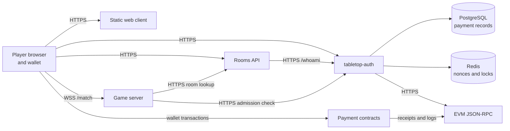

# Evanopolis V1 Operator Handoff

Status: release-candidate baseline. Artifact identifiers remain placeholders
until the candidate is frozen after the active delivery lanes land.

This document is the starting point for deploying Evanopolis V1. It describes
the repository as it exists on 2026-09-25; it does not claim that a
client-controlled production environment has been deployed.

## Deployable Artifacts

| Artifact | Source | Build or published location | Runtime |
| --- | --- | --- | --- |
| Game server | this repository | `deploy/docker/game-server/Dockerfile`; `ghcr.io/falafel-open-games/evanopolis-v1-game-server:sha-<commit>` | Node.js container, HTTP and WebSocket |
| Rooms API | this repository | `deploy/docker/rooms-api/Dockerfile`; `ghcr.io/falafel-open-games/evanopolis-v1-rooms-api:sha-<commit>` | Node.js container, HTTP |
| Web client | this repository | GitHub Pages build from `.github/workflows/pages.yml`; versioned archive from `.github/workflows/web-release.yml` | Static HTTPS host |
| Auth and payment API | sibling private `tabletop-auth` repository | its `Dockerfile` or an image pinned to its own source revision | Node.js container, HTTP |
| Auth payment records | external service | PostgreSQL 16-compatible database | Durable storage |
| Auth nonces and locks | external service | Redis 7-compatible service | Ephemeral coordination |
| Rooms metadata | Rooms API volume | file selected by `ROOMS_DATA_FILE` | Durable single-writer volume |

The two GHCR workflows publish both `latest` and immutable
`sha-<40-character-git-commit>` tags. A release must use the `sha-...` tag and
record the resolved image digest. `latest` is not a release identifier.

Pushing an approved `v*` tag builds the web client from that exact revision and
creates a draft GitHub prerelease containing the versioned archive,
`web-release-manifest.json`, and `SHA256SUMS`. A human must inspect the assets
and verification evidence before publishing the draft. GitHub Pages remains
the hosted demo/reference deployment; the release archive is the portable
handoff artifact.

For a local candidate build, export and package with:

```bash
just godot-web-export
just package-web-release v1.0.0-rc.1 <full-40-character-commit> dist
```

The archive excludes wrapper tests and repository-only README files. Extract
it into the document root of a static HTTPS host and serve `index.html`.

## Service Topology



Public routing must preserve HTTPS for all HTTP services and WebSocket upgrade
headers for the game server `/match` endpoint. The browser origin must be
allowed by both the Rooms API and `tabletop-auth` CORS configuration.

## Configuration

Use the checked-in, secret-free templates:

- `deploy/env/game-server.env.example`
- `deploy/env/rooms-api.env.example`
- `deploy/env/tabletop-auth.env.example`

The `tabletop-auth` template is a handoff inventory, not its source of truth.
Reconcile it with the pinned auth revision's `.env.example` before deployment.
Keep private keys, database credentials, Redis credentials, RPC credentials,
and deployment tokens in the target platform's secret manager.

The browser currently selects its service URLs from hostname-sensitive defaults
or explicit query parameters. Before production acceptance, verify that the
published entry URL resolves to the intended Rooms API, auth API, and game
WebSocket endpoints. Do not rely on the current Fly staging defaults for a
client-owned environment. A runtime deployment configuration file remains a
cross-lane requirement for a portable production bundle; until it exists, this
limitation must be called out in release notes and endpoint selection must be
validated explicitly.

## Startup Order

1. Provision PostgreSQL and Redis for `tabletop-auth`.
2. Configure and start `tabletop-auth`; verify `GET /health`.
3. Provision the Rooms API data volume, configure the auth URL, and start the
   Rooms API; verify `GET /healthz`.
4. Configure the game server with the Rooms API and auth URLs and start exactly
   one replica; verify `GET /health` and its expected build version.
5. Publish the static web bundle with the final public service routing.
6. Validate CORS, wallet sign-in, room creation, invitation lookup, payment,
   admission, WebSocket upgrade, refresh, and reconnect.

## Health and Diagnostics

| Component | Check | Expected evidence |
| --- | --- | --- |
| `tabletop-auth` | `GET /health` | HTTP 200 |
| Rooms API | `GET /healthz` | HTTP 200 with `{"ok":true}` |
| Game server | `GET /health` | HTTP 200 with `ok`, service name, and candidate build version |
| Game WebSocket | upgrade `/match` | Successful WebSocket connection followed by protocol join |
| Web client | load entry URL | HTML, scripts, Godot `.wasm` and `.pck` load without browser errors |

Repository smoke commands:

```bash
just rooms-api-smoke https://<rooms-api-host>
just game-server-smoke https://<game-server-host>
curl -fsS https://<auth-host>/health
```

Inspect service logs for configuration errors, upstream auth failures, room
lookup failures, payment verification failures, and rejected admissions. Never
log or paste full JWTs, wallet signatures, private keys, database URLs, Redis
URLs, or RPC URLs containing credentials into the handoff record.

## Persistence and Backup

- Game server match state is memory-only. It must run as one replica. A restart
  loses active matches, and horizontal scaling is unsafe without persistence or
  session affinity plus a shared match store.
- Rooms metadata is a JSON file written atomically by one Rooms API process.
  Mount durable storage at the configured file location, run one writer, and
  snapshot the volume before upgrades. There is no built-in retention or
  restore command.
- `tabletop-auth` stores durable payment verification state in PostgreSQL.
  The target operator owns database backups, restore testing, and retention.
- Redis holds nonces and short-lived coordination state. Loss invalidates
  pending sign-ins but must not replace PostgreSQL backups.

## Upgrade and Rollback

1. Record the running release manifest and back up Rooms API and auth data.
2. Pull images by digest and stage the new static web archive.
3. Upgrade in startup order: auth, Rooms API, game server, then web client.
4. Run health checks after every service and stop on the first failure.
5. Run the paid two-player smoke path before declaring the upgrade complete.
6. To roll back, restore the previous image digests and web archive. Restore
   data only when a reviewed schema or data migration requires it; the current
   Evanopolis services do not provide automated migrations.

Because active matches are in memory, restarting or rolling back the game
server interrupts them. Schedule upgrades outside active play or explicitly
accept match loss for the candidate environment.

## First-Deployment Checklist

- [ ] Choose public hostnames and the TLS termination owner.
- [ ] Confirm the target can pull the three pinned container images.
- [ ] Record exact source revisions, image digests, web archive checksum, and
      build identifier in `release-manifest.template.yaml`.
- [ ] Provision PostgreSQL, Redis, and a Rooms API persistent volume.
- [ ] Store secrets in the platform secret manager and inject non-secret
      configuration from the reviewed environment contract.
- [ ] Add the exact web origin to Rooms API and auth CORS configuration.
- [ ] Confirm outbound HTTPS access to the configured EVM RPC endpoint.
- [ ] Confirm reverse-proxy WebSocket upgrade support for `/match`.
- [ ] Start services in the documented order and record health results.
- [ ] Exercise room create, invite lookup, two-wallet sign-in, allowance,
      payment, verification, join, refresh, and expired-session reconnect.
- [ ] Record failures, owners, and next actions; do not mark the environment
      accepted while a required path remains untested.

## External Decisions and Ownership

The client/operator must still choose the final hostnames, infrastructure,
registry access, secret manager, backup policy, supported browsers/wallets,
blockchain/RPC configuration, and whether the first environment uses the
existing blockchain ticket path, a client prepaid-credit integration, or both.
DNS, TLS, credentials, and client infrastructure are not delivered by this
repository.

The current project-hosted Fly and GitHub Pages services are staging evidence,
not proof of deployment in the client's environment. See
`docs/deployment/staging-paid-flow.md` for the last recorded staged paid-path
validation and its date.
